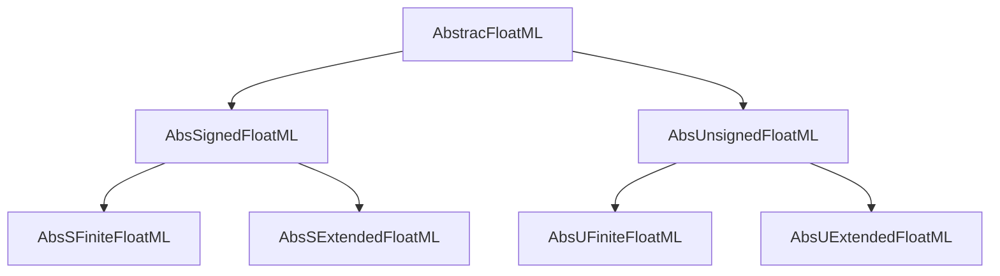
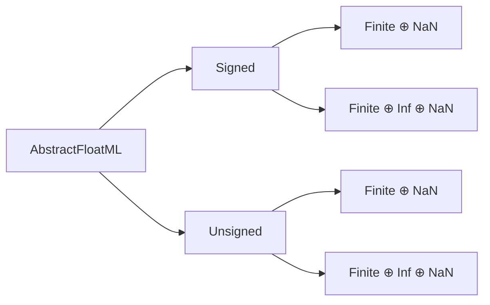

# Abstractions




----



----

### Computing over these abstractions

Every predicate, count, and extremal value available in [Type Specifics] is defined over these abstract types. We do not require instantiations to know characterizations.  The way that we stage our abstract parameterizations allows the freedom to use declarations like this:

```julia

nValues(T::Type{AbstractFloatML{Bits,Precision}}) where {Bits,Precision} = 2^Bits
nNumericValues(T::Type{AbstractFloatML}) = nValues(T) - 1 # remove NaN
nFiniteValues(T::Type{AbstractFloatML}) = nNumericValues(T) - nInfs(T) # remove Infs

nInfs(T::Type{AbstractFloatML}) = is_extended(T) * (is_signed(T) + is_extended(T))
```
and then
```
for F in (:nValues, :nNumericValues, :nFiniteValues, :nInfs)
    @eval $(F)(x::AbstractFloatML) = $(F)(typeof(x))
end
```
