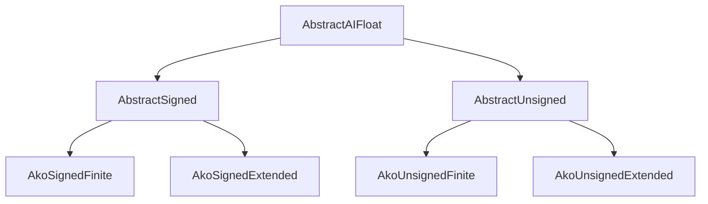
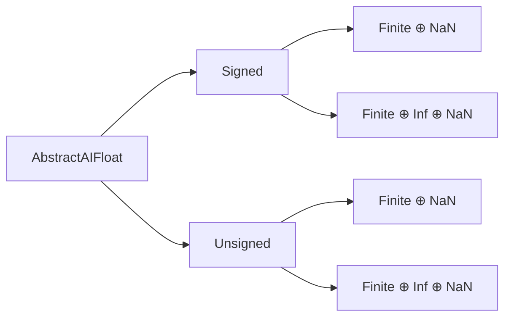
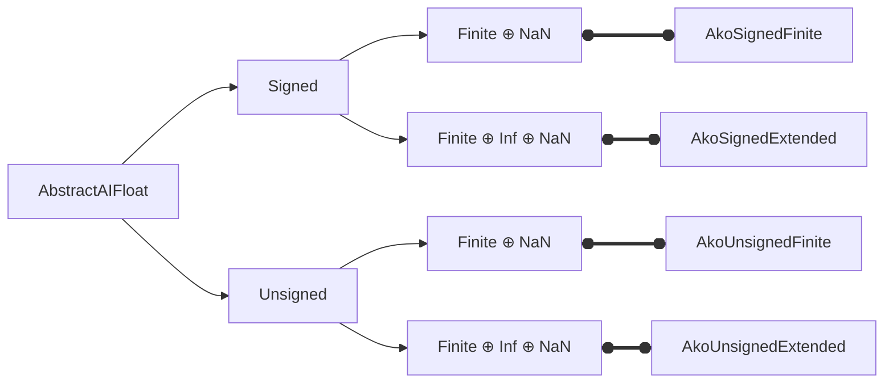

# Abstractions

----



----





----

### Computing over these abstractions

Every predicate, count, and extremal value available in [Type Specifics] is defined over these abstract types. We do not require instantiations to know characterizations.  The way that we stage our abstract parameterizations allows the freedom to use declarations like this:

```julia
abstract type AbstractAIFloat{Bits, Precision} <: AbstractFloat end
#                        B is Bits, P is Precision == SigBits
bitsize(::Type{<:AbstractAIFloat{B,P}}) where {B,P} = B
sigbits(::Type{<:AbstractAIFloat{B,P}}) where {B,P} = P
# the fractional bits (or trailing significand bits) are explicitly stored
fracbits(::Type{<:AbstractAIFloat{B,P}}) where {B,P} = P - 1

signbits(T::Type{<:AbstractAIFloat{Bits,Precision}}) where {Bits,Precision} =
     0 + is_signed(T)

expbits(T::Type{<:AbstractAIFloat{Bits,Precision}}) where {Bits,Precision} =
   Bits - Precision + is_unsigned(T)

nvalues(T::Type{<:AbstractAIFloat}) = 2^nbits(T)
nvalues_numeric(T::Type{<:AbstractAIFloat}) = nvalues(T) - 1 # remove NaN
nvalues_finite(T::Type{<:AbstractAIFloat}) = nvalues_numeric(T) - nInfs(T) # remove Infs

nInfs(T::Type{<:AbstractAIFloat}) = is_extended(T) * (is_signed(T) + is_extended(T))
```
and then
```
for F in (:bitsize, :sigbits, :fracbits, :expbits, :signbits,
          :nvalues, :nvalues_numeric, :nvalues_finite, :nInfs)
    @eval $(F)(x::AbstractAIFloat) = $(F)(typeof(x))
end
```

====

In essence, this code provides a framework for creating custom floating-point numeric types in Julia by defining essential properties and methods that describe their bit structure. It allows the user to query information about bits, significance, and the count of representable values including handling special cases like NaN and infinity. This abstraction enables more straightforward implementation and manipulation of different floating-point representations in a systematic way.
