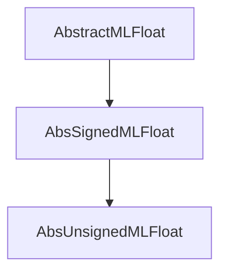

# Abstractions

export AbstractMLFloat,
         AbsSignedMLFloat,
           AbsSignedExtendedMLFloat, AbsSignedFiniteMLFloat,
              SExtendedMLFloats,        SFiniteMLFloats,
         AbsUnsignedMLFloat,
           AbsUnsignedExtendedMLFloat, AbsUnsignedFiniteMLFloat,
              UExtendedMLFloats,          UFiniteMLFloats,
       #
