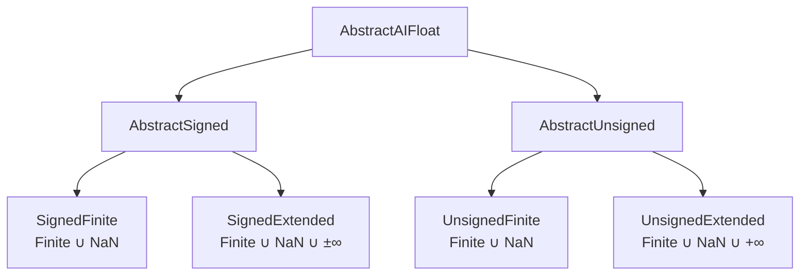

# AIFloats.jl

*Fast floating-point formats for deep learning: A family portrait*

AIFloats.jl implements a comprehensive family of AI-optimized floating-point formats with bitwidths from 3 to 15 bits, designed specifically for deep learning applications. This package provides formally verified implementations following the IEEE P3109 standard for reduced-precision arithmetic.

## Key Features

- **Four Format Families**: Signed/Unsigned × Finite/Extended configurations
- **Variable Precision**: 3-15 bit representations with configurable significand widths
- **Exception-Free Design**: No NaN propagation or infinity exceptions during computation
- **Formally Verified**: Conforming to IEEE P3109 standard specifications
- **Performance Optimized**: Cache-aligned memory allocation and lookup table acceleration
- **Comprehensive API**: Over 100 functions for format characterization and manipulation

## Quick Start

```julia
using AIFloats

# Create a 4-bit unsigned finite format with 2-bit precision
uf4p2 = AIFloat(4, 2, :unsigned, :finite)

# Access the value and encoding sequences
floats(uf4p2)  # [0.0, 0.25, 0.5, 0.75, 1.0, 1.25, 1.5, NaN]
codes(uf4p2)   # [0x00, 0x01, 0x02, 0x03, 0x04, 0x05, 0x06, 0x07]

# Query format properties
nbits(uf4p2)        # 4
nbits_sig(uf4p2)    # 2
nvalues(uf4p2)      # 8
is_finite(uf4p2)    # true
is_unsigned(uf4p2)  # true
```

## Format Taxonomy



## Mathematical Foundation

AIFloats represent **augmented binary rational numbers** $\mathbb{B}^\diamond = (\mathbb{Q}_2^* \cup \{\text{NaN}\})$, where:

- **Finite values**: Scaled significands with biased exponents
- **Prenormal regime**: Zero plus subnormal magnitudes (significand × minimum exponent)
- **Normal regime**: $(1 + \text{fractional}) \times 2^{\text{unbiased exponent}}$
- **Extended formats**: Include infinities for overflow handling
- **NaN encoding**: Deterministic placement opposite zero encoding

## Design Philosophy

> *"There are no Exceptional States - the flow of learning, training and inference is unbroken"*

Unlike traditional IEEE 754 arithmetic, AIFloats eliminate computational exceptions:
- No NaN propagation during normal operations
- No infinity generation from finite operands
- Deterministic overflow behavior with saturation
- Cache-friendly memory layouts for table-driven computation

## Package Ecosystem

- **[AIFloats.jl](https://github.com/JeffreySarnoff/AIFloats.jl)**: Core format definitions and utilities
- **[AlignedAllocs.jl](https://github.com/JeffreySarnoff/AlignedAllocs.jl)**: Cache-aligned memory allocation
- **[AIFloatTables.jl](https://github.com/JeffreySarnoff/AIFloatTables.jl)**: Lookup table generation for fast operations

## Standards Compliance

AIFloats.jl implements the **IEEE P3109 Standard for Arithmetic Formats for Machine Learning**, the first formally verified floating-point standard. This ensures:

- **Specification Conformance**: All operations match formal specifications
- **Behavioral Predictability**: Results meet informed expectations
- **Exception Safety**: No unexpected NaN or infinity generation

## Installation

```julia
using Pkg
Pkg.add("AIFloats")
```

## Related Work

- **IEEE 754-2019**: Traditional floating-point standard
- **IEEE P3109**: AI-optimized arithmetic standard (in development)
- **BFloat16, FP8**: Hardware-specific reduced precision formats